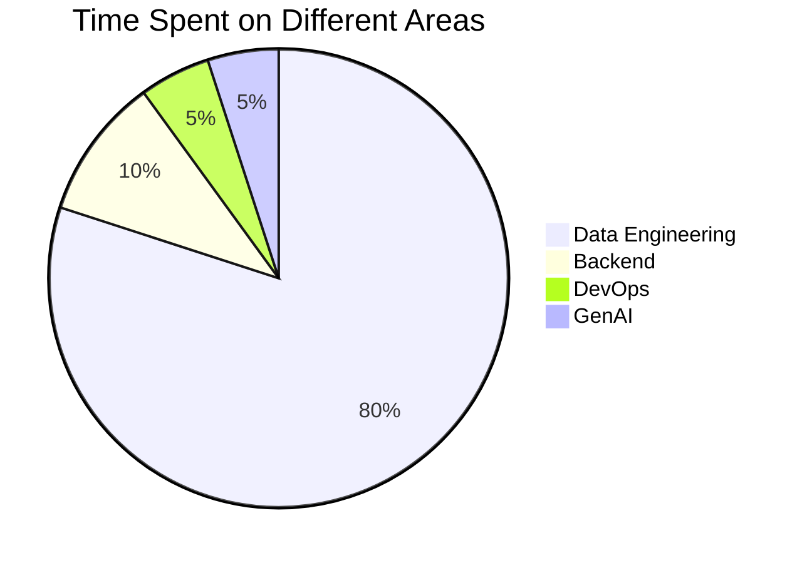

# Hello, folks! 

  

I'm **Kuldeep Pal**, a **Big Data Engineer** from Pune, India, currently working at Walmart Global Tech. 

## 🧐 About Me:

- 🔭 My primary coding languages: Python, Scala, SQL
- 🏆 Earned Gold badge & 5 star at [HackerRank](https://www.hackerrank.com/kuldeep27396) in Python programming and SQL
- 🌱 I'm passionate about the Data Domain and I'm exploring Big Data, Cloud, and Machine Learning
- 💬 Ask me about anything, I am happy to help
- 📝 [Resume](#)

## 🛠️ Skills

### Programming Languages:

### Big Data:

### Cloud:

### Databases:

### Tools/CICD:

### Soft Skills:
- Collaboration
- Teamwork
- Problem-Solving
- Stakeholder Management

## 🕰️ Time Distribution

Here's how I've spent my time on average over the last 6 years:

## ✍️ Blog & Writing

Apart from Data Engineering, I also maintain a blog - you can find my articles on [Medium](https://medium.com/@kuldeep27396).

## &#x1f4c8; GitHub Stats

## 🔗 &nbsp;**Connect with me**

<!-- Links to your social media accounts -->

[1]: https://twitter.com/kuldeep27396
[2]: https://github.com/kuldeep27396
[3]: https://www.linkedin.com/in/kuldeep27396
